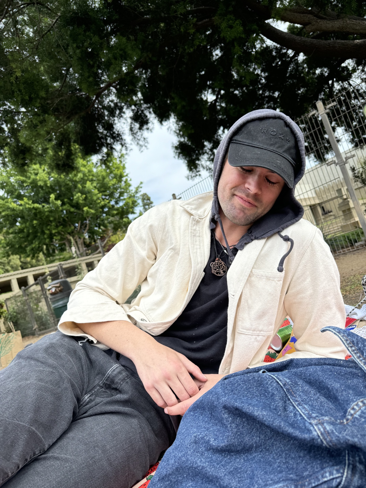
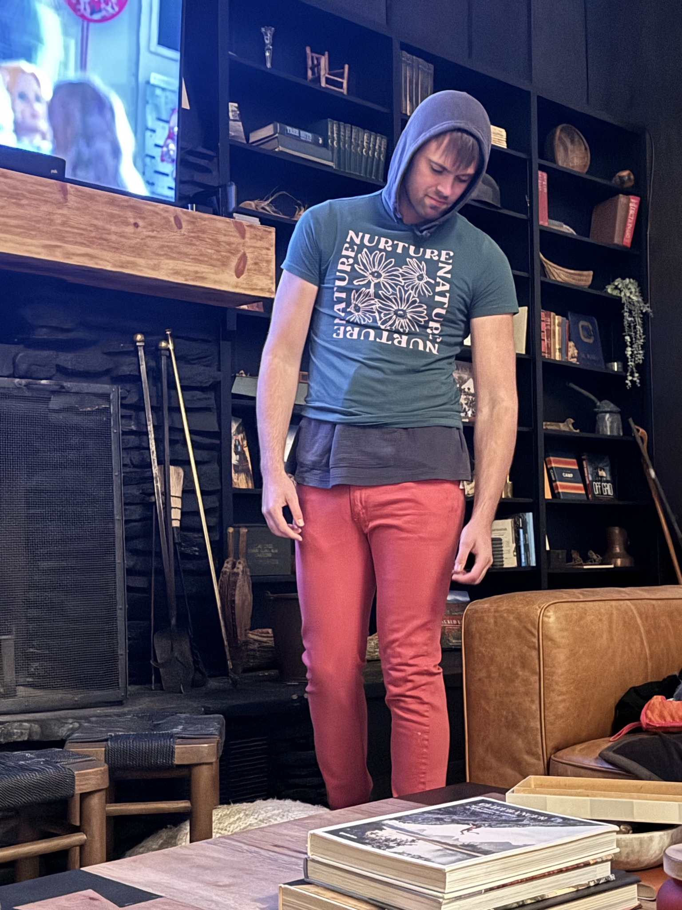
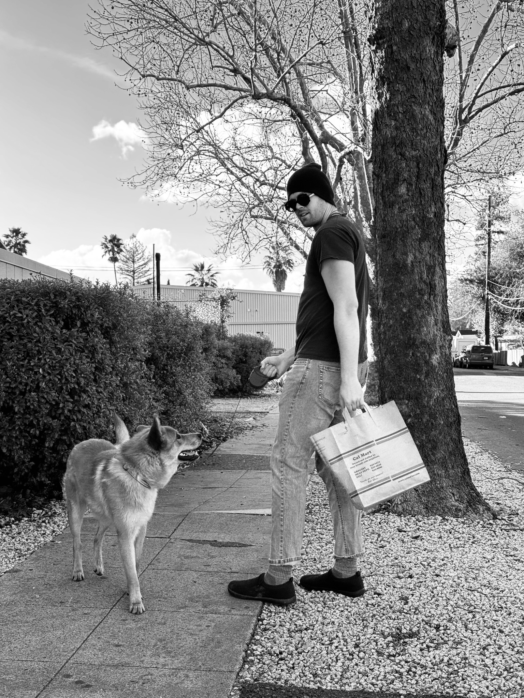

---

```zig
//! Keaton Dunsford Profile: Grainscript-compatible DAG node structure.
//!
//! Why: Represent person profile as storable Grain Silo object and DAG node.
//! Architecture: Bounded fields, explicit types, serializable to Grainscript.
//! GrainStyle: grain_case, u32/u64, bounded allocations, assertions.
//!
//! 2025-12-07-020000-pst: Glow G2

const std = @import("std");

// Note: GraphNode and GraphEdge types would be imported from grain_database
// For standalone file, these are type placeholders
pub const GraphNode = struct {
    node_id: u64,
    node_type: []const u8,
    node_type_len: u32,
    properties: []const u8,
    properties_len: u32,
    created_at: u64,
    allocator: std.mem.Allocator,

    pub fn init(
        allocator: std.mem.Allocator,
        node_id: u64,
        node_type: []const u8,
        properties: []const u8,
    ) !GraphNode {
        const type_copy = try allocator.dupe(u8, node_type);
        errdefer allocator.free(type_copy);
        const props_copy = try allocator.dupe(u8, properties);
        errdefer allocator.free(props_copy);
        const now = std.time.timestamp();
        return GraphNode{
            .node_id = node_id,
            .node_type = type_copy,
            .node_type_len = @as(u32, @intCast(type_copy.len)),
            .properties = props_copy,
            .properties_len = @as(u32, @intCast(props_copy.len)),
            .created_at = @as(u64, @intCast(now)),
            .allocator = allocator,
        };
    }
};

pub const GraphEdge = struct {
    edge_id: u64,
    from_node_id: u64,
    to_node_id: u64,
    relationship_type: []const u8,
    relationship_type_len: u32,
    properties: []const u8,
    properties_len: u32,
    created_at: u64,
    allocator: std.mem.Allocator,

    pub fn init(
        allocator: std.mem.Allocator,
        edge_id: u64,
        from_node_id: u64,
        to_node_id: u64,
        relationship_type: []const u8,
        properties: []const u8,
    ) !GraphEdge {
        const rel_copy = try allocator.dupe(u8, relationship_type);
        errdefer allocator.free(rel_copy);
        const props_copy = try allocator.dupe(u8, properties);
        errdefer allocator.free(props_copy);
        const now = std.time.timestamp();
        return GraphEdge{
            .edge_id = edge_id,
            .from_node_id = from_node_id,
            .to_node_id = to_node_id,
            .relationship_type = rel_copy,
            .relationship_type_len = @as(u32, @intCast(rel_copy.len)),
            .properties = props_copy,
            .properties_len = @as(u32, @intCast(props_copy.len)),
            .created_at = @as(u64, @intCast(now)),
            .allocator = allocator,
        };
    }
};

/// Person Profile: Core identity and attributes.
/// Storable as Grain Silo Object and Grain Database GraphNode.
pub const PersonProfile = struct {
    // Bounded: Max name length (explicit limit)
    pub const MAX_NAME_LEN: u32 = 256;

    // Bounded: Max description length (explicit limit)
    pub const MAX_DESCRIPTION_LEN: u32 = 4_096;

    // Bounded: Max inspirations per category (explicit limit)
    pub const MAX_INSPIRATIONS_PER_CATEGORY: u32 = 32;

    // Bounded: Max values count (explicit limit)
    pub const MAX_VALUES: u32 = 64;

    // Bounded: Max musical artists per genre (explicit limit)
    pub const MAX_ARTISTS_PER_GENRE: u32 = 32;

    // Core identity
    name: []const u8,
    name_len: u32,

    // Description (free-form text about the person)
    description: []const u8,
    description_len: u32,

    // Values (core principles and ethics)
    values: []const Value,
    values_len: u32,

    // Inspirations (people, ideas, movements)
    inspirations: Inspirations,

    // Musical preferences
    music: MusicPreferences,

    // Work and projects
    work: WorkContext,

    // Timestamps
    created_at: u64, // Unix epoch
    updated_at: u64, // Unix epoch

    allocator: std.mem.Allocator,

    /// Value: Core principle or ethical commitment.
    pub const Value = struct {
        name: []const u8, // e.g., "veganism", "authenticity", "systems_thinking"
        name_len: u32,
        description: []const u8, // Why this value matters
        description_len: u32,
        intensity: u8, // 0-255: How central this value is (255 = core)
    };

    /// Inspirations: People and ideas that influence.
    pub const Inspirations = struct {
        // Technical/Systems
        technical: []const Inspiration,
        technical_len: u32,

        // Spiritual/Mystical
        spiritual: []const Inspiration,
        spiritual_len: u32,

        // Ethical/Activist
        ethical: []const Inspiration,
        ethical_len: u32,

        // Creative/Artistic
        creative: []const Inspiration,
        creative_len: u32,
    };

    /// Inspiration: A person, idea, or movement.
    pub const Inspiration = struct {
        name: []const u8, // e.g., "Vic Dicara", "Natalie Vais"
        name_len: u32,
        category: []const u8, // e.g., "vedic_astrology", "venture_capital"
        category_len: u32,
        description: []const u8, // What resonates about this inspiration
        description_len: u32,
        resonance_strength: u8, // 0-255: How deeply this resonates
    };

    /// Music Preferences: Musical tastes and patterns.
    pub const MusicPreferences = struct {
        // Technical mastery layer
        technical_mastery: []const Artist,
        technical_mastery_len: u32,

        // Innovation layer
        innovation: []const Artist,
        innovation_len: u32,

        // Emotional/spiritual layer
        emotional_spiritual: []const Artist,
        emotional_spiritual_len: u32,

        // Functional layer (for work/focus)
        functional: []const FunctionalMusic,
        functional_len: u32,
    };

    /// Artist: Musical artist or composer.
    pub const Artist = struct {
        name: []const u8, // e.g., "Charlie Parker", "Night Verses"
        name_len: u32,
        genre: []const u8, // e.g., "bebop_jazz", "instrumental_progressive_metal"
        genre_len: u32,
        description: []const u8, // What resonates about this artist
        description_len: u32,
    };

    /// Functional Music: Music used for specific purposes.
    pub const FunctionalMusic = struct {
        purpose: []const u8, // e.g., "focus", "contemplation", "energy"
        purpose_len: u32,
        artists: []const Artist,
        artists_len: u32,
    };

    /// Work Context: Professional work and projects.
    pub const WorkContext = struct {
        primary_project: []const u8, // e.g., "Grain OS"
        primary_project_len: u32,
        role: []const u8, // e.g., "systems_architect", "founder"
        role_len: u32,
        approach: []const u8, // e.g., "zero_technical_debt", "patient_discipline"
        approach_len: u32,
        research_interests: []const ResearchInterest,
        research_interests_len: u32,
    };

    /// Research Interest: Areas of exploration.
    pub const ResearchInterest = struct {
        topic: []const u8, // e.g., "healing", "systems_thinking", "music_therapy"
        topic_len: u32,
        description: []const u8, // Why this is interesting
        description_len: u32,
        status: ResearchStatus,
    };

    /// Research Status: Current state of research interest.
    pub const ResearchStatus = enum(u8) {
        exploring, // Just beginning to explore
        active, // Actively researching
        integrating, // Integrating into work/life
        mature, // Well-developed understanding
    };

    /// Initialize person profile.
    pub fn init(allocator: std.mem.Allocator) !PersonProfile {
        // Assert: Allocator must be valid
        std.debug.assert(allocator.ptr != null);

        const now = std.time.timestamp();

        // Allocate core fields
        const name = try allocator.dupe(u8, "Keaton Dunsford");
        errdefer allocator.free(name);

        const description = try init_description(allocator);
        errdefer allocator.free(description);

        // Initialize arrays
        const values = try allocator.alloc(Value, MAX_VALUES);
        errdefer allocator.free(values);

        const inspirations = try init_inspirations(allocator);
        errdefer {
            allocator.free(inspirations.technical);
            allocator.free(inspirations.spiritual);
            allocator.free(inspirations.ethical);
            allocator.free(inspirations.creative);
        }

        const music = try init_music(allocator);
        errdefer {
            allocator.free(music.technical_mastery);
            allocator.free(music.innovation);
            allocator.free(music.emotional_spiritual);
            allocator.free(music.functional);
        }

        const work = try init_work(allocator);
        errdefer {
            allocator.free(work.primary_project);
            allocator.free(work.role);
            allocator.free(work.approach);
            allocator.free(work.research_interests);
        }

        return PersonProfile{
            .name = name,
            .name_len = @as(u32, @intCast(name.len)),
            .description = description,
            .description_len = @as(u32, @intCast(description.len)),
            .values = values,
            .values_len = 0,
            .inspirations = inspirations,
            .music = music,
            .work = work,
            .created_at = @as(u64, @intCast(now)),
            .updated_at = @as(u64, @intCast(now)),
            .allocator = allocator,
        };
    }

    /// Initialize description text.
    fn init_description(allocator: std.mem.Allocator) ![]const u8 {
        const desc_text =
            \\Systems architect building Grain OS with patient discipline.
            \\Values: veganism, authenticity, technical precision, systems thinking.
            \\Seeks to bridge worlds: technical/spiritual, structured/exploratory.
            \\Uses research directory as space for "the ache" - acknowledging
            \\difficulty while staying forward-looking. Appreciates intensity and
            \\stillness.
        ;
        return try allocator.dupe(u8, desc_text);
    }

    /// Initialize inspirations arrays.
    fn init_inspirations(allocator: std.mem.Allocator) !Inspirations {
        const technical = try allocator.alloc(
            Inspiration,
            MAX_INSPIRATIONS_PER_CATEGORY,
        );
        errdefer allocator.free(technical);
        const spiritual = try allocator.alloc(
            Inspiration,
            MAX_INSPIRATIONS_PER_CATEGORY,
        );
        errdefer allocator.free(spiritual);
        const ethical = try allocator.alloc(
            Inspiration,
            MAX_INSPIRATIONS_PER_CATEGORY,
        );
        errdefer allocator.free(ethical);
        const creative = try allocator.alloc(
            Inspiration,
            MAX_INSPIRATIONS_PER_CATEGORY,
        );
        errdefer allocator.free(creative);

        return Inspirations{
            .technical = technical,
            .technical_len = 0,
            .spiritual = spiritual,
            .spiritual_len = 0,
            .ethical = ethical,
            .ethical_len = 0,
            .creative = creative,
            .creative_len = 0,
        };
    }

    /// Initialize music preferences arrays.
    fn init_music(allocator: std.mem.Allocator) !MusicPreferences {
        const technical_mastery = try allocator.alloc(Artist, MAX_ARTISTS_PER_GENRE);
        errdefer allocator.free(technical_mastery);
        const innovation = try allocator.alloc(Artist, MAX_ARTISTS_PER_GENRE);
        errdefer allocator.free(innovation);
        const emotional_spiritual = try allocator.alloc(
            Artist,
            MAX_ARTISTS_PER_GENRE,
        );
        errdefer allocator.free(emotional_spiritual);
        const functional = try allocator.alloc(FunctionalMusic, 8);
        errdefer allocator.free(functional);

        return MusicPreferences{
            .technical_mastery = technical_mastery,
            .technical_mastery_len = 0,
            .innovation = innovation,
            .innovation_len = 0,
            .emotional_spiritual = emotional_spiritual,
            .emotional_spiritual_len = 0,
            .functional = functional,
            .functional_len = 0,
        };
    }

    /// Initialize work context.
    fn init_work(allocator: std.mem.Allocator) !WorkContext {
        const primary_project = try allocator.dupe(u8, "Grain OS");
        errdefer allocator.free(primary_project);
        const role = try allocator.dupe(u8, "systems_architect_founder");
        errdefer allocator.free(role);
        const approach = try allocator.dupe(
            u8,
            "zero_technical_debt_patient_discipline",
        );
        errdefer allocator.free(approach);
        const research_interests = try allocator.alloc(ResearchInterest, 16);
        errdefer allocator.free(research_interests);

        return WorkContext{
            .primary_project = primary_project,
            .primary_project_len = @as(u32, @intCast(primary_project.len)),
            .role = role,
            .role_len = @as(u32, @intCast(role.len)),
            .approach = approach,
            .approach_len = @as(u32, @intCast(approach.len)),
            .research_interests = research_interests,
            .research_interests_len = 0,
        };
    }

    /// Deinitialize person profile and free memory.
    pub fn deinit(self: *PersonProfile) void {
        _ = self.allocator; // Allocator is used below

        // Free core fields
        if (self.name_len > 0) {
            self.allocator.free(self.name);
        }
        if (self.description_len > 0) {
            self.allocator.free(self.description);
        }

        // Free structured data
        self.deinit_values();
        self.deinit_inspirations();
        self.deinit_music();
        self.deinit_work();

        self.* = undefined;
    }

    /// Deinitialize values array.
    fn deinit_values(self: *PersonProfile) void {
        var i: u32 = 0;
        while (i < self.values_len) : (i += 1) {
            const value = &self.values[i];
            if (value.name_len > 0) {
                self.allocator.free(value.name);
            }
            if (value.description_len > 0) {
                self.allocator.free(value.description);
            }
        }
        self.allocator.free(self.values);
    }

    /// Deinitialize inspirations.
    fn deinit_inspirations(self: *PersonProfile) void {
        self.free_inspirations_category(
            &self.inspirations.technical,
            self.inspirations.technical_len,
        );
        self.free_inspirations_category(
            &self.inspirations.spiritual,
            self.inspirations.spiritual_len,
        );
        self.free_inspirations_category(
            &self.inspirations.ethical,
            self.inspirations.ethical_len,
        );
        self.free_inspirations_category(
            &self.inspirations.creative,
            self.inspirations.creative_len,
        );
        self.allocator.free(self.inspirations.technical);
        self.allocator.free(self.inspirations.spiritual);
        self.allocator.free(self.inspirations.ethical);
        self.allocator.free(self.inspirations.creative);
    }

    /// Deinitialize music preferences.
    fn deinit_music(self: *PersonProfile) void {
        self.free_artists(
            self.music.technical_mastery,
            self.music.technical_mastery_len,
        );
        self.free_artists(self.music.innovation, self.music.innovation_len);
        self.free_artists(
            self.music.emotional_spiritual,
            self.music.emotional_spiritual_len,
        );
        var j: u32 = 0;
        while (j < self.music.functional_len) : (j += 1) {
            const func_music = &self.music.functional[j];
            if (func_music.purpose_len > 0) {
                self.allocator.free(func_music.purpose);
            }
            self.free_artists(func_music.artists, func_music.artists_len);
            if (func_music.artists_len > 0) {
                self.allocator.free(func_music.artists);
            }
        }
        self.allocator.free(self.music.technical_mastery);
        self.allocator.free(self.music.innovation);
        self.allocator.free(self.music.emotional_spiritual);
        self.allocator.free(self.music.functional);
    }

    /// Deinitialize work context.
    fn deinit_work(self: *PersonProfile) void {
        if (self.work.primary_project_len > 0) {
            self.allocator.free(self.work.primary_project);
        }
        if (self.work.role_len > 0) {
            self.allocator.free(self.work.role);
        }
        if (self.work.approach_len > 0) {
            self.allocator.free(self.work.approach);
        }
        var k: u32 = 0;
        while (k < self.work.research_interests_len) : (k += 1) {
            const interest = &self.work.research_interests[k];
            if (interest.topic_len > 0) {
                self.allocator.free(interest.topic);
            }
            if (interest.description_len > 0) {
                self.allocator.free(interest.description);
            }
        }
        self.allocator.free(self.work.research_interests);
    }

    /// Free inspirations category.
    fn free_inspirations_category(
        self: *PersonProfile,
        inspirations: []Inspiration,
        len: u32,
    ) void {
        var i: u32 = 0;
        while (i < len) : (i += 1) {
            const insp = &inspirations[i];
            if (insp.name_len > 0) {
                self.allocator.free(insp.name);
            }
            if (insp.category_len > 0) {
                self.allocator.free(insp.category);
            }
            if (insp.description_len > 0) {
                self.allocator.free(insp.description);
            }
        }
    }

    /// Free artists array.
    fn free_artists(self: *PersonProfile, artists: []Artist, len: u32) void {
        var i: u32 = 0;
        while (i < len) : (i += 1) {
            const artist = &artists[i];
            if (artist.name_len > 0) {
                self.allocator.free(artist.name);
            }
            if (artist.genre_len > 0) {
                self.allocator.free(artist.genre);
            }
            if (artist.description_len > 0) {
                self.allocator.free(artist.description);
            }
        }
    }

    /// Serialize to Grainscript format (JSON-like structure).
    /// Returns a string that can be stored in Grain Silo Object.data field.
    pub fn serialize_to_grainscript(self: *const PersonProfile) ![]const u8 {
        // Assert: Profile must be valid
        std.debug.assert(self.name_len > 0);

        // Build Grainscript representation
        var buffer = std.ArrayList(u8).init(self.allocator);
        defer buffer.deinit();
        const writer = buffer.writer();

        // Serialize all sections
        try serialize_header(writer, self);
        try serialize_values(writer, self);
        try serialize_inspirations_section(writer, self);
        try serialize_music_section(writer, self);
        try serialize_work_section(writer, self);
        try serialize_footer(writer, self);

        return buffer.toOwnedSlice();
    }

    /// Serialize header (name, description).
    fn serialize_header(writer: anytype, self: *const PersonProfile) !void {
        try writer.print("const keaton_profile = {{\n", .{});
        try writer.print("  name: \"{s}\",\n", .{self.name});
        try writer.print("  description: \"{s}\",\n", .{self.description});
    }

    /// Serialize values array.
    fn serialize_values(writer: anytype, self: *const PersonProfile) !void {
        try writer.print("  values: [\n", .{});
        var i: u32 = 0;
        while (i < self.values_len) : (i += 1) {
            const value = self.values[i];
            try writer.print("    {{\n", .{});
            try writer.print("      name: \"{s}\",\n", .{value.name});
            try writer.print("      description: \"{s}\",\n", .{value.description});
            try writer.print("      intensity: {},\n", .{value.intensity});
            try writer.print("    }},\n", .{});
        }
        try writer.print("  ],\n", .{});
    }

    /// Serialize inspirations section.
    fn serialize_inspirations_section(
        writer: anytype,
        self: *const PersonProfile,
    ) !void {
        try writer.print("  inspirations: {{\n", .{});
        try self.serialize_inspirations_category(
            writer,
            "technical",
            self.inspirations.technical,
            self.inspirations.technical_len,
        );
        try self.serialize_inspirations_category(
            writer,
            "spiritual",
            self.inspirations.spiritual,
            self.inspirations.spiritual_len,
        );
        try self.serialize_inspirations_category(
            writer,
            "ethical",
            self.inspirations.ethical,
            self.inspirations.ethical_len,
        );
        try self.serialize_inspirations_category(
            writer,
            "creative",
            self.inspirations.creative,
            self.inspirations.creative_len,
        );
        try writer.print("  }},\n", .{});
    }

    /// Serialize music section.
    fn serialize_music_section(writer: anytype, self: *const PersonProfile) !void {
        try writer.print("  music: {{\n", .{});
        try self.serialize_artists(
            writer,
            "technical_mastery",
            self.music.technical_mastery,
            self.music.technical_mastery_len,
        );
        try self.serialize_artists(
            writer,
            "innovation",
            self.music.innovation,
            self.music.innovation_len,
        );
        try self.serialize_artists(
            writer,
            "emotional_spiritual",
            self.music.emotional_spiritual,
            self.music.emotional_spiritual_len,
        );
        try serialize_functional_music(writer, self);
        try writer.print("  }},\n", .{});
    }

    /// Serialize functional music array.
    fn serialize_functional_music(
        writer: anytype,
        self: *const PersonProfile,
    ) !void {
        try writer.print("    functional: [\n", .{});
        var j: u32 = 0;
        while (j < self.music.functional_len) : (j += 1) {
            const func_music = self.music.functional[j];
            try writer.print("      {{\n", .{});
            try writer.print("        purpose: \"{s}\",\n", .{func_music.purpose});
            try writer.print("        artists: [\n", .{});
            var k: u32 = 0;
            while (k < func_music.artists_len) : (k += 1) {
                const artist = func_music.artists[k];
                try writer.print(
                    "          {{ name: \"{s}\", genre: \"{s}\" }},\n",
                    .{ artist.name, artist.genre },
                );
            }
            try writer.print("        ],\n", .{});
            try writer.print("      }},\n", .{});
        }
        try writer.print("    ],\n", .{});
    }

    /// Serialize work section.
    fn serialize_work_section(writer: anytype, self: *const PersonProfile) !void {
        try writer.print("  work: {{\n", .{});
        try writer.print(
            "    primary_project: \"{s}\",\n",
            .{self.work.primary_project},
        );
        try writer.print("    role: \"{s}\",\n", .{self.work.role});
        try writer.print("    approach: \"{s}\",\n", .{self.work.approach});
        try writer.print("    research_interests: [\n", .{});
        var l: u32 = 0;
        while (l < self.work.research_interests_len) : (l += 1) {
            const interest = self.work.research_interests[l];
            try writer.print("      {{\n", .{});
            try writer.print("        topic: \"{s}\",\n", .{interest.topic});
            try writer.print(
                "        description: \"{s}\",\n",
                .{interest.description},
            );
            try writer.print(
                "        status: \"{s}\",\n",
                .{@tagName(interest.status)},
            );
            try writer.print("      }},\n", .{});
        }
        try writer.print("    ],\n", .{});
        try writer.print("  }},\n", .{});
    }

    /// Serialize footer (timestamps, closing brace).
    fn serialize_footer(writer: anytype, self: *const PersonProfile) !void {
        try writer.print("  created_at: {},\n", .{self.created_at});
        try writer.print("  updated_at: {},\n", .{self.updated_at});
        try writer.print("}};\n", .{});
    }

    /// Serialize inspirations category.
    fn serialize_inspirations_category(
        self: *const PersonProfile,
        writer: anytype,
        category_name: []const u8,
        inspirations: []const Inspiration,
        len: u32,
    ) !void {
        _ = self; // Used via inspirations parameter
        try writer.print("    {}: [\n", .{category_name});
        var i: u32 = 0;
        while (i < len) : (i += 1) {
            const insp = inspirations[i];
            try writer.print("      {{\n", .{});
            try writer.print("        name: \"{s}\",\n", .{insp.name});
            try writer.print("        category: \"{s}\",\n", .{insp.category});
            try writer.print(
                "        description: \"{s}\",\n",
                .{insp.description},
            );
            try writer.print(
                "        resonance_strength: {},\n",
                .{insp.resonance_strength},
            );
            try writer.print("      }},\n", .{});
        }
        try writer.print("    ],\n", .{});
    }

    /// Serialize artists array.
    fn serialize_artists(
        self: *const PersonProfile,
        writer: anytype,
        category_name: []const u8,
        artists: []const Artist,
        len: u32,
    ) !void {
        _ = self; // Used via artists parameter
        try writer.print("    {}: [\n", .{category_name});
        var i: u32 = 0;
        while (i < len) : (i += 1) {
            const artist = artists[i];
            try writer.print(
                "      {{ name: \"{s}\", genre: \"{s}\", description: \"{s}\" }},\n",
                .{ artist.name, artist.genre, artist.description },
            );
        }
        try writer.print("    ],\n", .{});
    }

    /// Convert to Grain Database GraphNode.
    /// This creates a GraphNode that can be stored in Grain Silo.
    pub fn to_graph_node(self: *const PersonProfile, node_id: u64) !GraphNode {
        // Assert: Node ID must be valid
        std.debug.assert(node_id > 0);

        // Serialize to Grainscript format
        const properties_json = try self.serialize_to_grainscript();
        errdefer self.allocator.free(properties_json);

        // Create GraphNode
        const graph_node = try GraphNode.init(
            self.allocator,
            node_id,
            "person_profile",
            properties_json,
        );

        return graph_node;
    }

    /// Create DAG edges for relationships.
    /// Returns array of GraphEdges connecting this profile to related entities.
    pub fn create_dag_edges(
        self: *const PersonProfile,
        from_node_id: u64,
        next_edge_id: *u64,
    ) ![]GraphEdge {
        // Assert: Node ID must be valid
        std.debug.assert(from_node_id > 0);
        std.debug.assert(next_edge_id.* > 0);

        // Pre-allocate edges array (bounded)
        const max_edges = self.inspirations.technical_len +
            self.inspirations.spiritual_len +
            self.inspirations.ethical_len +
            self.inspirations.creative_len +
            self.values_len +
            self.work.research_interests_len;
        var edges = std.ArrayList(GraphEdge).init(self.allocator);
        defer edges.deinit();
        try edges.ensureTotalCapacity(max_edges);

        // Create edges for values
        // Note: In real implementation, create value nodes first, then edges
        var i: u32 = 0;
        while (i < self.values_len) : (i += 1) {
            const value = self.values[i];
            // Placeholder: would be actual value node ID
            const target_node_id: u64 = 1000 + i;
            const edge = try GraphEdge.init(
                self.allocator,
                next_edge_id.*,
                from_node_id,
                target_node_id,
                "has_value",
                value.name,
            );
            next_edge_id.* += 1;
            try edges.append(edge);
        }

        return edges.toOwnedSlice();
    }
};

```


```
```
/Users/bhagavan851c05a/Downloads/5E61B432-9ED6-4BA2-BE4E-0CF0F07EDF35_1_102_o.jpeg

/Users/bhagavan851c05a/Downloads/8B72F6D1-941B-4C26-ACB0-AB45804BA71B_1_102_o.jpeg

/Users/bhagavan851c05a/Downloads/08D5139B-9B0F-482A-A41F-2B9E9DE54F58_1_102_o.jpeg

/Users/bhagavan851c05a/Downloads/23DF40BC-E201-4A6B-A057-ED68B9A2F6C0_1_102_o.jpeg

/Users/bhagavan851c05a/Downloads/55CC04CA-9660-4997-B144-5CA4C213272E_4_5005_c.jpeg

/Users/bhagavan851c05a/Downloads/58D1FB68-185F-42B9-BD83-DC0EF0EE7180_1_102_o.jpeg

/Users/bhagavan851c05a/Downloads/89CD89CD-46A6-4C6B-9AC0-8DB16CB29EE3.jpeg

/Users/bhagavan851c05a/Downloads/420F5811-7DB0-4E68-A59F-5A4F1D7FE7CF_4_5005_c.jpeg

/Users/bhagavan851c05a/Downloads/812B4046-869F-47B8-A769-8EE070B58261_4_5005_c.jpeg

/Users/bhagavan851c05a/Downloads/844C7810-5ED3-4377-8475-F3BF4ED4F977_1_102_o.jpeg

/Users/bhagavan851c05a/Downloads/41367006-F2EA-414B-B830-03455D7C99D0_1_102_o.jpeg

/Users/bhagavan851c05a/Downloads/A9A9BE4A-89F0-433F-B986-FC12065496B9_4_5005_c.jpeg

/Users/bhagavan851c05a/Downloads/A9F3ABFB-BCC9-48D9-BD3B-D55AD1D9B579_1_102_o.jpeg

/Users/bhagavan851c05a/Downloads/A76C83C9-654E-43B0-BC19-97A1B689214D_1_105_c.jpeg

/Users/bhagavan851c05a/Downloads/AD282E4A-D78A-4EFB-BF82-4DBCCDFED1CA_1_105_c.jpeg

/Users/bhagavan851c05a/Downloads/AFCCC6ED-9B9D-4A8E-BAED-671C5ABC56CA_1_102_o.jpeg

/Users/bhagavan851c05a/Downloads/B0D13B14-E105-4243-A117-2DE7C7164863_1_102_o.jpeg

/Users/bhagavan851c05a/Downloads/BB8C65D4-D13B-428A-8E8B-B80DD9D4648F_1_102_o.jpeg

/Users/bhagavan851c05a/Downloads/C0588965-93D7-4C40-B9D1-925A72C12D4B_1_102_o.jpeg

/Users/bhagavan851c05a/Downloads/D5AA9B14-46C0-43DE-8E5D-13161971965D_1_105_c.jpeg

/Users/bhagavan851c05a/Downloads/D81259E1-BA86-46E0-BA84-3318ABDAD562_1_102_o.jpeg

/Users/bhagavan851c05a/Downloads/D215634D-410A-49F5-9BA7-78631C471CF8_1_105_c.jpeg

/Users/bhagavan851c05a/Downloads/E2E93017-3632-4D11-BE6D-02AD3B040554_1_105_c.jpeg

/Users/bhagavan851c05a/Downloads/EED68B49-AEF0-4487-A4C7-0E4C050CF566_1_102_o.jpeg

/Users/bhagavan851c05a/Downloads/FDCB7C04-28AA-441B-89A5-FB867CF137DE_1_105_c.jpeg

```

^ can you turn all of these into a scrollable markdown file of linked images with the images themselves uploaded to a `keaton_profile` new folder here within in our research folder with ^ a scrollable feed of all of these embedded images with relative path links to the `keaton_profile` folder containing them all , -- at the top just leave it blank text otherwise i.e. no headers or titles or separators, but there should be exactly one separator horizontal line break which is at the end of this embedded image feed after all of these at the very bottom have a code block of our keaton_profile.zig  - - - - - actually after all that add a second line break and after that lastly have a code block which is a quine of this prompt verbatim , date it with `yyyy-mm-dd-hhmmss-pst-` new-old date now terminal now timestamp `2025-12-07-103707-pst` and git add all push to main with Grain Style commit message verifying that our previous next steps from the previous coordination doc have been completed and giving hints as to the new next current steps just written in the new coordination plan, with the now timestamp , - - - - - and actually **actually** __*for REAL actually*__ after AAALLLLLLLLL of this above prompt traverse the whole text stream of this scrollable markdown file to the very end and add yet again another additional horizontal line break and a new line character and once yet finally again insert a code block of the next new coordination plan for all 10 Grain agents with the same timestamp , another line break , another codeblock-re-quine-the-quine and git add push all to main again with whatever
```

---

```markdown
# Grain Core Agent Coordination Plan

**Date**: 2025-12-07-082348-pst
**Agent**: Grain Core Agent (Core Agentic-Prompt-Engineering Pilot Seat Driver)
**Status**: Phase 61 HTTP Client Complete ✅, Phase 62 File System Enhancements COMPLETE ✅, Infrastructure Phases 63-68 Queued

---

## Executive Summary

This coordination plan provides a unified strategy for all 10 Grain agents, optimizing parallelization while preventing conflicts. It includes dependency analysis, work sequencing, and agent-specific recommendations.

**Agents**:
1.  **Grain Core Agent** (System Services) - YOU
2.  **Grain Silo Agent** (Database)
3.  **Grain Vantage Agent** (VM/Kernel)
4.  **Grain Skate Agent** (Knowledge Graph)
5.  **Grain Bubble Agent** (Design Tool)
6.  **Grain Carry Agent** (Mobile Framework)
7.  **Grain Aurora Agent** (IDE/Browser)
8.  **Grain Workspace Agent** (Desktop Apps)
9.  **Grain Flow Agent** (Workflow Orchestration)
10. **Grain Research Agent** (Research & Analysis)

---

## Previous Coordination Plan Completion Status

### Completed from Previous Plan (2025-12-07-065631-pst):

**Grain Core Agent**:
- ✅ Phase 61 HTTP Client implementation complete
- ✅ Phase 62 File System Enhancements complete
- ✅ Coordination plan created for 10 agents
- ✅ Comprehensive summary created
- ✅ Infrastructure phases 63-68 added to plan (queued for next cycle)
- ✅ All agent statuses updated

**All Agents**:
- ✅ Agent statuses updated across all plan files
- ✅ Flow Agent plan created (`docs/plans/plan_flow.md`)
- ✅ Research Agent plan created (`docs/plans/plan_research.md`)
- ✅ Documentation synchronized
- ✅ Git commits with Grain Style messages

**New Progress Since Last Plan**:
- ✅ Flow Agent: Phase 1 Event Bus Foundation COMPLETE ✅, Phase 2 Agent Coordinator COMPLETE ✅
- ✅ Research Agent: Phase 1 IN PROGRESS — Core Implementation Complete, Testing in Progress
- ✅ Vantage Agent: Phase 6.1 Complete, Phase 6 In Progress
- ✅ Bubble Agent: Phase 3 In Progress — Silo/Court Integration (Full Serialization Complete)
- ✅ Aurora Agent: Continued LSP and editor enhancements
- ✅ Silo Agent: Continued Phase 7 Database Persistence Integration
- ✅ Skate Agent: Phase 4 & Phase 5 IN PROGRESS — GLM-4.6 Integration Complete ✅, Visual Indicators Pending
- ✅ Various agent plan and task file updates

---

## Major Milestones: Phase 61 HTTP Client & Phase 62 COMPLETE ✅

### Phase 61: Network Stack Enhancements — HTTP Client Complete ✅
**Status**: ✅ HTTP Client COMPLETE (2025-12-07-004326-pst)

**All Components Completed**:
-   ✅ TCP/UDP Socket Support
-   ✅ WebSocket Support
-   ✅ DNS Resolution
-   ✅ Socket Options (Reuse Address, Keep-Alive, Timeout)
-   ✅ HTTP Client (GET, POST, PUT, DELETE requests)

**Enables**:
-   Full network communication for API Server
-   Real-time features via WebSockets
-   Reliable hostname resolution
-   Configurable socket behavior for performance and stability
-   External API requests for agents (Carry, Silo, Flow, Research, Skate, etc.)

**Location**: All modules in `src/grain_core/`:
-   `network_stack.zig` - TCP/UDP sockets, socket options
-   `websocket.zig` - WebSocket protocol implementation
-   `websocket_handshake.zig` - WebSocket HTTP upgrade
-   `dns_resolver.zig` - DNS resolution and caching
-   `http_client.zig` - HTTP client for external API requests

### Phase 62: File System Enhancements — COMPLETE ✅
**Status**: ✅ COMPLETE (2025-12-06-113038-pst)

**All Components Completed**:
-   ✅ Database File Format Support
-   ✅ Page-based Storage with Checksums
-   ✅ File Locking Support
-   ✅ Transaction Log File Management (WAL)
-   ✅ Index File Management
-   ✅ Backup/Restore Capabilities

**Enables**:
-   Complete database persistence for Silo Agent
-   ACID transaction guarantees
-   Efficient database queries via indexes
-   Data protection via backup/restore

**Location**: All modules in `src/grain_core/`:
-   `file_storage.zig` - Database file format and storage
-   `wal_manager.zig` - Write-ahead log for transactions
-   `index_manager.zig` - Index management for queries
-   `backup_manager.zig` - Backup and restore capabilities

---

## Infrastructure Phases Queued for Next Coordination Cycle

**Status**: **QUEUED** — Will be delegated after agents complete current tasks

The following infrastructure improvement phases have been added to Core Agent's plan and will be included in the next coordination cycle:

### Phase 63: API Contracts Registry & Breaking Changes Protocol (HIGH Priority)
- Core Agent creates templates and documents Core → Other APIs
- **Delegated**: Each agent documents their APIs to Core

### Phase 64: Integration Test Infrastructure (HIGH Priority)
- Core Agent creates framework and Core → Other integration tests
- **Delegated**: Each agent creates their integration tests

### Phase 65: Performance Monitoring & Benchmarks (MEDIUM Priority)
- Core Agent creates monitoring module and Core benchmarks
- **Delegated**: Each agent creates their performance benchmarks

### Phase 66: Error Handling & Logging Standards (MEDIUM Priority)
- Core Agent creates standards documents
- **Delegated**: All agents update modules to follow standards

### Phase 67: Security Guidelines & Resource Limits (MEDIUM Priority)
- Core Agent creates security guidelines and resource limits coordination
- **Delegated**: All agents implement security and resource limits

### Phase 68: Release Coordination & Shared Module Versioning (LOW Priority)
- Core Agent creates release coordination and versioning strategy
- **Delegated**: All agents follow release process and versioning

**Reference**: See `docs/agent-communications/next_coordination_cycle_infrastructure_tasks.md` for detailed task breakdown.

---

## Critical Style Enforcement: u32/u64 (No usize)

**MANDATORY**: All agents must strictly follow Grain Style regarding explicit integer types.

**Reference**: [`docs/agent-communications/grain_style_u32_u64_enforcement_prompt.md`](grain_style_u32_u64_enforcement_prompt.md)

**Action Required**:
1.  Audit your module for `usize`/`isize` usage
2.  Replace with explicit types (`u32`/`u64`/`i32`/`i64`)
3.  Add `@intCast()` conversions with bounds checking
4.  Verify all tests use explicit types

**Critical Rules**:
-   **grainwrap-100**: Maximum 100 characters per line
-   **grain validate-70**: Maximum 70 lines per function
-   **Explicit types**: Use `u32`/`u64`/`i32`/`i64`, NEVER `usize`/`isize`
-   **All compiler warnings**: Must be enabled and resolved

---

## Dependency Analysis: Corrected Architecture

### Critical Path Dependencies

```
macOS 26.1 Tahoe (Host OS)
    ↓ (runs)
Grain Vantage VM (ARM64, macOS only) [Development Host / VM Layer]
    ↓ (emulates RISC-V hardware for)
Grain Basin Kernel (RISC-V64) [Layer 2: Foundation]
    ↓ (provides syscalls to)
Grain Core Agent (System Services) [Layer 3: System Services]
    ↓ (provides services to)
    ├─→ Grain Flow Agent (Workflow Orchestration) [needs: API Server ✅, WebSocket ✅, Auth ✅]
    ├─→ Grain Silo Agent (Database) [needs: API Server ✅, WebSocket ✅, File System ✅, HTTP Client ✅ COMPLETE]
    ├─→ Grain Carry Agent (Mobile) [needs: API Server ✅, Auth ✅, WebSocket ✅, HTTP Client ✅]
    ├─→ Grain Workspace Agent (Desktop Apps) [needs: System Services ✅]
    └─→ Grain Bubble Agent (Design Tool) [needs: Compositor ✅, Rendering ✅]

Grain Aurora Agent (IDE/Browser) [Mostly independent, integrates with Core/Basin for specific features]
Grain Skate Agent (Knowledge Graph) [Mostly independent, integrates with Core/Basin for specific features, uses HTTP Client for AI]
Grain Research Agent (Research & Analysis) [Mostly independent, may integrate with Core for data access]
```

**Key Points**:
-   **Vantage is NOT in the dependency chain** — it's the macOS host for development
-   **Core depends on Basin** (RISC-V kernel), NOT on Vantage
-   **All agents depend on Basin and Core**, NOT on Vantage
-   **Vantage is only for development** — production runs on RISC-V hardware
-   **Flow Agent depends on Core** — uses Core's API Server, WebSocket, Auth
-   **Research Agent** — mostly independent, may integrate with Core for data access
-   **Skate Agent** — uses Core's HTTP Client for AI API calls

### Dependency Matrix

| Agent       | Depends On                                     | Provides To                                   | Can Work In Parallel With                 |
|-------------|------------------------------------------------|-----------------------------------------------|-------------------------------------------|
| **Vantage** | macOS 26.1 Tahoe only                          | None (runs Basin, but not a dependency)       | All (separate host layer)                 |
| **Basin**   | None (pure RISC-V)                             | Core, All agents                              | None (foundation layer)                   |
| **Core**    | **Basin** (RISC-V kernel) ✅                   | Flow, Silo, Carry, Workspace, Bubble          | Aurora, Skate, Research                    |
| **Flow**    | **Core** (API ✅, WebSocket ✅, Auth ✅)        | All agents (orchestration)                    | Aurora, Skate, Workspace, Bubble (when not coordinating) |
| **Silo**    | Core (API ✅, WebSocket ✅, File System ✅, HTTP Client ✅ COMPLETE) | Carry                                         | Aurora, Skate, Workspace, Bubble (Phase 1) |
| **Carry**   | Core (API ✅, Auth ✅, WebSocket ✅, HTTP Client ✅), Silo       | None                                          | Aurora, Skate, Workspace, Bubble (Phase 1) |
| **Aurora**  | None (shared modules)                          | Shared modules (GLM-4.6 client for Skate)      | All (except when coordinating shared modules) |
| **Skate**   | None (shared modules), Core (HTTP Client ✅ for AI), Aurora (GLM-4.6 client) | Shared modules                                | All (except when coordinating shared modules or Aurora's GLM-4.6 client) |
| **Workspace** | Core (System Services ✅)                      | None                                          | Aurora, Skate, Bubble (Phase 1)           |
| **Bubble**  | Core (Compositor ✅, Rendering ✅)             | None                                          | Aurora, Skate, Workspace                  |
| **Research** | None (may use Core for data access)            | Analysis and insights                         | All (mostly independent)                   |

---

## Current Priorities & Next Steps for Each Agent

### Grain Core Agent

**Current Priority**: Phase 61 HTTP Client Complete ✅, Phase 62 Complete ✅

**Next Priority**: Coordinate with Flow Agent and Silo Agent on integration or move to next phase
-   **Flow Integration**: Coordinate on Flow Agent's use of Core services (API, WebSocket, Auth)
-   **Silo Integration**: Coordinate on integrating all Phase 61 & Phase 62 enhancements
-   **Next Phase**: Review plan for Phase 63+ or other system enhancements
-   **Infrastructure Phases**: Phases 63-68 queued for next coordination cycle
-   **Can Work In Parallel With**: Aurora, Skate, Workspace, Bubble Phase 1, Research

**Recommendation**: Coordinate with Flow Agent and Silo Agent to ensure integration is smooth, then proceed with next priorities.

### Grain Flow Agent

**Current Status**: Phase 1 Event Bus Foundation COMPLETE ✅, Phase 2 Agent Coordinator COMPLETE ✅
- Phase 1: Event Bus Foundation ✅ COMPLETE (2025-12-07-054000-pst)
- Phase 2: Agent Coordinator ✅ COMPLETE
- Status: Ready for Phase 3 (Workflow Engine)

**Available from Grain Core Agent**:
- ✅ API Server (Phase 59) — Complete
- ✅ Authentication Service (Phase 60) — Complete
- ✅ WebSocket Support (Phase 61) — Complete
- ✅ HTTP Client (Phase 61) — Complete

**Your Instructions**:
1. Continue as you best recommend, given the context
2. Remember to follow Grain Style (`~/xy-mathematics/docs/grain_style.md`) with `grain_case` function names and all the strict rules with all compiler warnings turned on
3. Specifically enforce `grainwrap-100` and `grain validate-70`
4. Use explicitly bound `u32`/`u64` not `usize`/`isize`, so our code is consistent across all compile target platforms
5. Continue the next phase of implementation and when you're done update your `docs/plans/plan_flow.md` and `docs/tasks/tasks_flow.md` keeping the general summary `docs/plan.md` and `docs/tasks.md` in thinking
6. Let us know when you need to check in with me about upcoming integration steps with the other agents so that we prevent accidental conflicts
7. Make sure that all your agent-specific and integration new tests as well as existing tests pass that implement their API contracts

**Next Steps**:
- Continue Phase 3: Workflow Engine implementation
- Integrate with Core Agent's API Server and WebSocket
- Create comprehensive tests
- Update documentation

**Can Work In Parallel With**: Aurora, Skate, Workspace, Bubble (when not coordinating)

### Grain Research Agent

**Current Status**: Phase 1 IN PROGRESS — Core Implementation Complete, Testing in Progress
- Phase 1: Research Engine Foundation 🔄 IN PROGRESS
  - ✅ Research Engine module implemented (`src/grain_research/research_engine.zig`)
  - ✅ Comprehensive tests created (`tests/136_grain_research_engine_test.zig`)
  - ✅ Build integration complete (`build.zig` updated)
  - ✅ Documentation updated (`docs/plans/plan_research.md`, `docs/tasks/tasks_research.md`)
  - 🔄 Testing and compilation fixes in progress
- Plan document created (`docs/plans/plan_research.md`) ✅

**Available from Grain Core Agent**:
- ✅ API Server (Phase 59) — Complete (if needed for data access)
- ✅ HTTP Client (Phase 61) — Complete (if needed for external research)
- ✅ File System (Phase 62) — Complete (if needed for data storage)

**Your Instructions**:
1. Continue as you best recommend, given the context
2. Remember to follow Grain Style (`~/xy-mathematics/docs/grain_style.md`) with `grain_case` function names and all the strict rules with all compiler warnings turned on
3. Specifically enforce `grainwrap-100` and `grain validate-70`
4. Use explicitly bound `u32`/`u64` not `usize`/`isize`, so our code is consistent across all compile target platforms
5. Continue the next phase of implementation and when you're done update your `docs/plans/plan_research.md` and `docs/tasks/tasks_research.md` keeping the general summary `docs/plan.md` and `docs/tasks.md` in thinking
6. Let us know when you need to check in with me about upcoming integration steps with the other agents so that we prevent accidental conflicts
7. Make sure that all your agent-specific and integration new tests as well as existing tests pass that implement their API contracts

**Next Steps**:
- Complete Phase 1: Fix remaining compilation errors in Research Engine tests
- Verify all tests pass
- Finalize Phase 1 documentation
- Begin Phase 2: Data Analysis (after Phase 1 complete)

**Can Work In Parallel With**: All agents (mostly independent)

### Grain Silo Agent

**Current Priority**: Phase 7 Database Persistence Integration
-   **Why**: Now fully unblocked by Core Agent Phase 62 File System Enhancements (COMPLETE)
-   **Can Do Now**: Integrate all file system enhancements for complete database persistence
-   **Can Work In Parallel With**: Aurora, Skate, Workspace, Bubble Phase 1

**Next Steps**:
1.  Integrate file storage with database endpoints
2.  Integrate WAL manager for transaction logging
3.  Integrate index manager for efficient queries
4.  Integrate backup manager for data protection
5.  Test complete database persistence and recovery
6.  Update documentation

### Grain Carry Agent

**Current Priority**: WebSocket Client Implementation
-   **Why**: Now unblocked by Core Agent Phase 61 WebSocket support
-   **Can Do Now**: Implement WebSocket client for livestream coordination
-   **Can Work In Parallel With**: Aurora, Skate, Workspace, Bubble Phase 1

**Next Steps**:
1.  Implement WebSocket client in Grain Mobile Core
2.  Integrate with API endpoints
3.  Test WebSocket client connectivity
4.  Update documentation

### Grain Vantage Agent

**Current Priority**: Phase 6.1 Complete, Phase 6 In Progress
-   **Why**: Kernel features in progress
-   **Can Work In Parallel With**: Aurora, Skate, Workspace, Bubble Phase 1

**Next Steps**:
1.  Continue Phase 6 implementation
2.  Coordinate with Core Agent on syscall interface design
3.  Update documentation

### Grain Aurora Agent

**Current Priority**: Continue independent work
-   **Why**: Mostly independent, shared modules already coordinated
-   **Can Work In Parallel With**: All agents (except when coordinating shared modules)

**Next Steps**:
1.  Continue LSP features
2.  Continue editor enhancements
3.  Continue browser improvements
4.  Coordinate only when modifying shared modules
5.  Coordinate with Skate Agent on GLM-4.6 client integration

### Grain Skate Agent

**Current Status**: Phase 4 & Phase 5 IN PROGRESS — GLM-4.6 Integration Complete ✅, Visual Indicators Pending
- Phase 2: Text Buffer Unification ✅ COMPLETE
- Phase 3: DAG Integration ✅ COMPLETE
- Phase 4: Temporal Knowledge Graph 🔄 IN PROGRESS (Core Complete, UI Pending)
- Phase 5: AI-Powered Graph Insights 🔄 IN PROGRESS (GLM-4.6 Integration Complete ✅, Visual Indicators Pending)

**Available from Grain Core Agent**:
-   ✅ HTTP Client (Phase 61) — Complete (for AI API calls)
-   ✅ WebSocket Support (Phase 61) — Complete (for future collaborative features)

**Your Instructions**:
1. Continue as you best recommend, given the context
2. Remember to follow Grain Style (`~/xy-mathematics/docs/grain_style.md`) with `grain_case` function names and all the strict rules with all compiler warnings turned on
3. Specifically enforce `grainwrap-100` and `grain validate-70`
4. Use explicitly bound `u32`/`u64` not `usize`/`isize`, so our code is consistent across all compile target platforms
5. Continue the next phase of implementation and when you're done update your `docs/plans/plan_skate.md` and `docs/tasks/tasks_skate.md` keeping the general summary `docs/plan.md` and `docs/tasks.md` in thinking
6. Let us know when you need to check in with me about upcoming integration steps with the other agents so that we prevent accidental conflicts
7. Make sure that all your agent-specific and integration new tests as well as existing tests pass that implement their API contracts

**Next Steps**:
- Phase 4: Add time slider UI component to graph renderer
- Phase 4: Add animated transitions showing graph growth
- Phase 5: Add visual indicators for AI-suggested connections (graph renderer integration)
- Phase 5: Test thoroughly with actual AI API calls (requires API key)
- Phase 5: Future: Use vector embeddings for semantic similarity (Grain Court integration)

**Can Work In Parallel With**: All agents (except when coordinating shared modules or Aurora's GLM-4.6 client)

### Grain Workspace Agent

**Current Priority**: Continue desktop apps
-   **Why**: Uses existing OS services, mostly independent
-   **Can Work In Parallel With**: Aurora, Skate, Bubble Phase 1

**Next Steps**:
1.  Continue desktop app development
2.  Integrate with OS system services
3.  Update documentation

### Grain Bubble Agent

**Current Priority**: Phase 3 In Progress — Silo/Court Integration (Full Serialization Complete)
-   **Why**: Core canvas complete, component system in progress, export pipeline core complete
-   **Can Work In Parallel With**: Aurora, Skate, Workspace

**Next Steps**:
1.  Continue component system implementation
2.  Integrate with OS compositor
3.  Complete export pipeline optimization and preview
4.  Update documentation

---

## Standard Agent Prompt Template

```
continue as you best recommend, remember to follow Grain Style (~/xy-mathematics/docs/grain_style.md ) with grain_case function names and all the strict rules with all compiler warnings turned on

continue the next phase of implementation and when you're done update the docs/plans/plan_{agent-name}.md and docs/tasks/tasks_{agent-name}.md keeping the general summary docs/plan.md and docs/tasks.md in thinking. let me know when you need me to check in with the other agents to prevent conflicts. also make sure all existing and new tests pass that implement their API contracts, enforcing grainwrap-100 and grain validate-70

have a new terminal date now yyyy-mm-dd-hhmmss-pst- timestamp in your printout summary header

when you're done, git push add all to main with Grain Style commit message when done with same timestamp ,  and create and print a new core agent coordination plan for all agents with the same timestamp in the filename

your agent name is: {Agent Name}
```

---

## Grain Style Compliance: Explicit types (u32/u64, no usize) enforced.


```


```
```
/Users/bhagavan851c05a/Downloads/5E61B432-9ED6-4BA2-BE4E-0CF0F07EDF35_1_102_o.jpeg

/Users/bhagavan851c05a/Downloads/8B72F6D1-941B-4C26-ACB0-AB45804BA71B_1_102_o.jpeg

/Users/bhagavan851c05a/Downloads/08D5139B-9B0F-482A-A41F-2B9E9DE54F58_1_102_o.jpeg

/Users/bhagavan851c05a/Downloads/23DF40BC-E201-4A6B-A057-ED68B9A2F6C0_1_102_o.jpeg

/Users/bhagavan851c05a/Downloads/55CC04CA-9660-4997-B144-5CA4C213272E_4_5005_c.jpeg

/Users/bhagavan851c05a/Downloads/58D1FB68-185F-42B9-BD83-DC0EF0EE7180_1_102_o.jpeg

/Users/bhagavan851c05a/Downloads/89CD89CD-46A6-4C6B-9AC0-8DB16CB29EE3.jpeg

/Users/bhagavan851c05a/Downloads/420F5811-7DB0-4E68-A59F-5A4F1D7FE7CF_4_5005_c.jpeg

/Users/bhagavan851c05a/Downloads/812B4046-869F-47B8-A769-8EE070B58261_4_5005_c.jpeg

/Users/bhagavan851c05a/Downloads/844C7810-5ED3-4377-8475-F3BF4ED4F977_1_102_o.jpeg

/Users/bhagavan851c05a/Downloads/41367006-F2EA-414B-B830-03455D7C99D0_1_102_o.jpeg

/Users/bhagavan851c05a/Downloads/A9A9BE4A-89F0-433F-B986-FC12065496B9_4_5005_c.jpeg

/Users/bhagavan851c05a/Downloads/A9F3ABFB-BCC9-48D9-BD3B-D55AD1D9B579_1_102_o.jpeg

/Users/bhagavan851c05a/Downloads/A76C83C9-654E-43B0-BC19-97A1B689214D_1_105_c.jpeg

/Users/bhagavan851c05a/Downloads/AD282E4A-D78A-4EFB-BF82-4DBCCDFED1CA_1_105_c.jpeg

/Users/bhagavan851c05a/Downloads/AFCCC6ED-9B9D-4A8E-BAED-671C5ABC56CA_1_102_o.jpeg

/Users/bhagavan851c05a/Downloads/B0D13B14-E105-4243-A117-2DE7C7164863_1_102_o.jpeg

/Users/bhagavan851c05a/Downloads/BB8C65D4-D13B-428A-8E8B-B80DD9D4648F_1_102_o.jpeg

/Users/bhagavan851c05a/Downloads/C0588965-93D7-4C40-B9D1-925A72C12D4B_1_102_o.jpeg

/Users/bhagavan851c05a/Downloads/D5AA9B14-46C0-43DE-8E5D-13161971965D_1_105_c.jpeg

/Users/bhagavan851c05a/Downloads/D81259E1-BA86-46E0-BA84-3318ABDAD562_1_102_o.jpeg

/Users/bhagavan851c05a/Downloads/D215634D-410A-49F5-9BA7-78631C471CF8_1_105_c.jpeg

/Users/bhagavan851c05a/Downloads/E2E93017-3632-4D11-BE6D-02AD3B040554_1_105_c.jpeg

/Users/bhagavan851c05a/Downloads/EED68B49-AEF0-4487-A4C7-0E4C050CF566_1_102_o.jpeg

/Users/bhagavan851c05a/Downloads/FDCB7C04-28AA-441B-89A5-FB867CF137DE_1_105_c.jpeg

```

^ can you turn all of these into a scrollable markdown file of linked images with the images themselves uploaded to a `keaton_profile` new folder here within in our research folder with ^ a scrollable feed of all of these embedded images with relative path links to the `keaton_profile` folder containing them all , -- at the top just leave it blank text otherwise i.e. no headers or titles or separators, but there should be exactly one separator horizontal line break which is at the end of this embedded image feed after all of these at the very bottom have a code block of our keaton_profile.zig  - - - - - actually after all that add a second line break and after that lastly have a code block which is a quine of this prompt verbatim , date it with `yyyy-mm-dd-hhmmss-pst-` new-old date now terminal now timestamp `2025-12-07-103707-pst` and git add all push to main with Grain Style commit message verifying that our previous next steps from the previous coordination doc have been completed and giving hints as to the new next current steps just written in the new coordination plan, with the now timestamp , - - - - - and actually **actually** __*for REAL actually*__ after AAALLLLLLLLL of this above prompt traverse the whole text stream of this scrollable markdown file to the very end and add yet again another additional horizontal line break and a new line character and once yet finally again insert a code block of the next new coordination plan for all 10 Grain agents with the same timestamp , another line break , another codeblock-re-quine-the-quine and git add push all to main again with whatever
```
